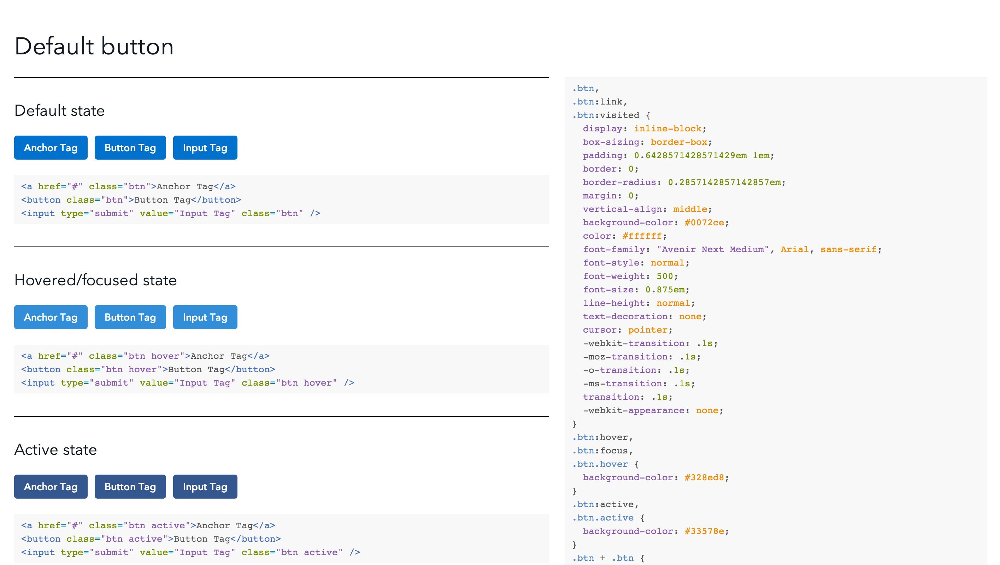
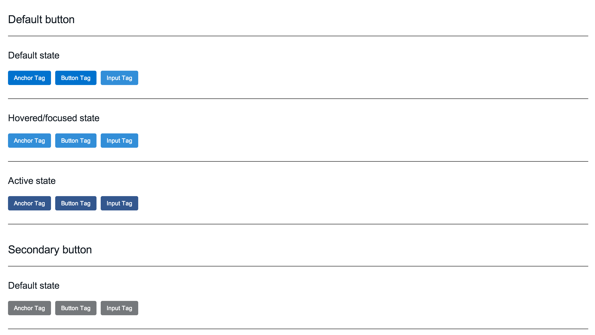

cf-component-demo
=================

Contains [Jade](http://jade-lang.com/) templates for creating docs and demos for Capital Framework components.

They are built to be consumed by [Topdoc](https://github.com/topcoat/topdoc) (A tool for generating usage guides for css). We use Topdoc in a Gruntfile via the [`grunt-topdoc`](https://github.com/topcoat/grunt-topdoc) task.

## The templates:

### code_examples

A CSS documentation template. This template lists, labels. and exposes the CSS and HTML code for each pattern. It uses [Rainbow](http://craig.is/making/rainbows) for syntax highlighting and [html5shiv](https://github.com/aFarkas/html5shiv) to polyfill the styling of HTML5 elements in older browsers. *Note that this template uses light CSS and JS that might affect your patterns.*



### simple

A simple template to list and label each pattern. No markup or CSS is shown. *Note that this template uses light CSS that might affect your patterns.*



### raw

A bare bones template that simply renders the markup for each pattern. This is a good template if you want to browser test your patterns without the interference of any other CSS.


# Getting started

First familiarize yourself with [Topdoc](https://github.com/topcoat/topdoc) and the [Topdoc comment specification](https://github.com/topcoat/topdoc#topdoc-comment-specification). The general idea is that you place special Topdoc comments in your stylesheet which Topdoc parses and then merges with a [Jade](http://jade-lang.com/) template. This repository contains custom templates that use [custom Topdoc comment formatting](#custom-topdoc-comment-specification) and [custom `grunt-topdoc` task options](#custom-grunt-topdoc-options).

**These instructions are from the perspective of a Captial Framework component repository which uses `grunt-topdoc` to generate demos and docs.**

**Requirements**

You need NPM and grunt-cli.

**Step 1:** In `package.json` list the `grunt-topdoc` and `cf-component-demo` npm packages as `devDependencies`.

```JSON
"devDependencies": {
  "grunt-topdoc": "~0.2.0",
  "cf-component-demo": "git://fake.ghe.domain/flapjack/cf-component-demo.git"
}
```

**Step 2:** Install the `devDependencies`.

`$ npm install`  

**Step 3:** Load the `grunt-topdoc` task in `Gruntfile.js`.

```JS
grunt.loadNpmTasks('grunt-topdoc');
```

**Step 4:** Set up the `grunt-topdoc` task in `Gruntfile.js`.

*[Read about the custom options we set up for these templates](#custom-topdoc-comment-specification)*

```JS
topdoc: {
  demo: {
    options: {
      source: 'demo/static/css/',
      destination: 'demo/',
      template: 'node_modules/fj-component-demo/' + ( grunt.option('tpl') || 'raw' ) + '/',
      templateData: {
        ltIE9AltSource: 'static/css/main.lt-ie9.min.css',
        ltIE8Source: 'static/css/main.lt-ie8.min.css',
        html5Shiv: true,
        family: '<%= pkg.name %>',
        title: '<%= pkg.name %> demo',
        repo: '<%= pkg.repository.url %>',
        custom: '<%= grunt.file.read("demo/custom.html") %>'
      }
    }
  }
}
```

**Step 5:** Run the `grunt-topdoc` task.

`$ grunt topdoc`

Your page will be exported to the `destination` path.


# Specs

## Custom Topdoc comment specification

### Topdoc parameters

We have expanded the YAML structure of what Topdoc handles out of the box. Data that is unique to these templates are labeled with *cf-only*.

- `name` (required): A name for a group of patterns. Topdoc assumes everything between two Topdoc comments is a group of patterns.
- `family` (required, *cf-only*): This should match the Capital Framework repository name in the `grunt-topdoc` options. It is used to identify the current components Topdoc comments so that it can ignore any other Topdoc comments that might come from other dependencies.
- `tags`: An array of obligatory tags. Right now we are tagging each pattern group with the current component family and any dependency family. In the future we hope to use these tags for enhancements such as listing all patterns with a specific dependency.
- `patterns` (*cf-only*): An array containing pattern objects. Patterns are broken up into groups, for example default buttons, secondary buttons, and tertiary buttons would all be good candidates for pattern groups. Within each group you can list the available patterns for example `.btn` and `.btn:hover` would each be their own pattern.
- `patterns[i].name` (*cf-only*): The name of the pattern.
- `patterns[i].codenotes`: An array of notes. Code notes are wrapped in `<pre>` and `<code>` tags and appear in a list.
- `patterns[i].notes` (*cf-only*): An array of notes. Notes appear in a list as normal text.
- `patterns[i].markup` (*cf-only*): You can write HTML in here and two things will happen. 
 - The HTML will be rendered on the page. 
 - The code will be exposed in pre code tags.

### Example comment formatting

```CSS
/* topdoc
    name: Example group name
    family: cf-example-component
    patterns:
    - name: Example pattern name
      codenotes:
        - "Code notes are wrapped in pre and code tags and appear in a list."
        - "..."
        - "..."
      notes:
        - "Notes appear in a list as normal text."
        - "..."
        - "..."
      markup: |
        <p>You can write HTML in here and two things will happen.</p>
        <ol>
          <li>The HTML will be rendered on the page.</li>
          <li>The code will be exposed in pre code tags.</li>
        </ol>
    - name: You can keep adding patterns
      markup: |
        <p>Foo.</p>
    tags:
    - example-tag
*/

.a-css-rule {
...
}

.another-css-rule {
...
}

/* topdoc
  name: EOF
  eof: true
*/
```

### Ignoring the rest of the stylesheet

By default Topdoc uses all CSS after a Topdoc comment. This means that if you concatenate your CSS files together there is a chance that unrelated CSS will be associated with your last Topdoc comment. To get around this you can either make sure that your CSS is last to be concatenated or you can use the `EOF` comment block. This comment block tells Topdoc to ignore everything after it and it looks like this:

```CSS
/* topdoc
  name: EOF
  eof: true
*/
```

## Custom `grunt-topdoc` options

- `source` (required): A directory containing CSS to be parsed and merged with a Jade template. Ignores `.min` files. Defaults to src/.
- `destination` (required): The destination directory where the usage guides will be written.
- `template` (required): The path to the jade template file.  If it is a directory it will import all the sub files.
- `templateData` (required): An object containing data to be passed to the Jade template.
 - `templateData.title` (required): A title to give to the page. It's used in `<title>`. It's also used as an `<h1>` for the page in the code_examples and simple templates.
 - `templateData.family` (required): This is the identifier that should also be used in the components Topdoc comments. It is used to ignore any other Topdoc comments that might come from dependencies.
 - `templateData.repo` (required): A link to the repository. The code_examples template uses this to link out to the source code.
 - `templateData.html5Shiv`: You can optionally add html5 shiv to the template by setting this option to true. Set it to false or exclude this option if you don't need it. Only used in the raw template.
 - `templateData.ltIE9AltSource`: A path to use if you need to serve an alternate version of your CSS to IE less than 9. Only used in the raw template.
 - `templateData.ltIE8Source`: A path to use if you need to include an additional stylesheet for IE less than 8. Only used in the raw template.
 - `templateData.custom`: A string of HTML to be appended to the raw template. Use `grunt.file.read` if you want to point to a file and convert it into a string.

### Example Grunt task

```JS
topdoc: {
  demo: {
    options: {
      source: 'demo/static/css/',
      destination: 'demo/',
      template: 'node_modules/fj-component-demo/raw/',
      templateData: {
        title: '<%= pkg.name %> demo',
        family: '<%= pkg.name %>',
        repo: '<%= pkg.repository.url %>',
        html5Shiv: true,
        ltIE9AltSource: 'static/css/main.lt-ie9.min.css',
        ltIE8Source: 'static/css/main.lt-ie8.min.css',
        custom: '<%= grunt.file.read("demo/custom.html") %>'
      }
    }
  }
}
```
